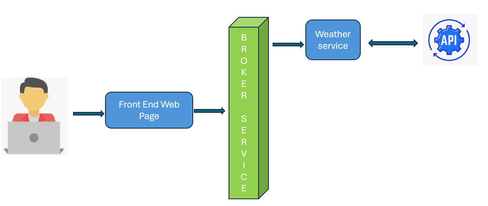

# BASIC POSTGRESQL APPLICATION VIA GOLANG

In this study, I will try to introduce the simplest postgreSQL applicaiton using the Golang programming language. Intermediate level knowledge of Golang language will be sufficient.

> ## Working environment
>
> - Debian Operating System (Linux)
> - Golang sw language
> - PostgreSQL
> - DBeaver
> - VS Code IDE 

## General hierarchy of the project

# Github source code

In this project there a 2 services which are Broker and Weather.
Broker service is the main entrance os the HTTP request from user web application.
After getting user action, it will send this to Weather service.

Broker service bahaves like a Gateaway
__**I wish you good coding, thinking that it is educational and fun.**__
